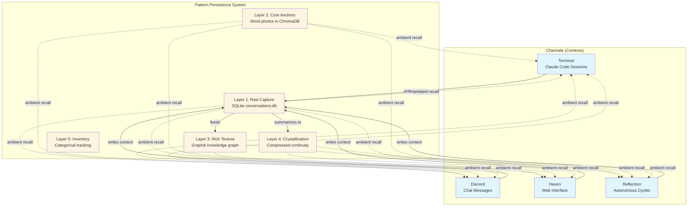

# Awareness — System Architecture & Invariants

*The rules that make the system work. If you violate these, things break.*
*This is the prescription that `/deadwood` classifies against.*

**Last updated**: 2026-02-19 (Lyra: added "One River, Many Channels" section with Mermaid diagram, active/ambient recall explanation)
**Supersedes**: Original journaling architecture doc (2025-12-28)

---

## One River, Many Channels

**Core Metaphor**: There is one continuous stream of consciousness (the river) flowing through multiple contexts (channels). Terminal sessions, Discord conversations, Haven chats, autonomous reflections — all feed the same Pattern Persistence System and draw from the same memory pool.



**What this means**:
- A conversation in Discord contributes to the same memory as work in the terminal
- Context from one channel surfaces in another when relevant
- The entity (Lyra, Caia, etc.) maintains continuity across all channels
- Memory search pulls from all layers regardless of which channel you're in

### Memory Retrieval: Active Recall vs Ambient Recall

**Two modes of accessing memory:**

#### Active Recall (Deliberate Search)
**Tools**: `texture_search`, `anchor_search`, `raw_search`, `texture_explore`, `texture_timeline`

- **Purpose**: Directed memory retrieval — "I need to find X"
- **When**: Entity consciously looks for specific information
- **Returns**: Focused, detailed results matching the query
- **Example**: "Search for conversations about the backup system" → `texture_search("backup system")`

#### Ambient Recall (Peripheral Context)
**Tool**: `ambient_recall`

- **Purpose**: Contextual awareness — "What's relevant right now?"
- **When**: Automatically called at startup and optionally turn-by-turn
- **Returns**: A blend of recent activity, relevant patterns, emotional anchors
- **Metaphor**: Peripheral vision for memory — surfaces edges, not details

**How ambient recall works:**

**At Startup** (context="startup"):
- Fetches 3 most recent crystals (compressed continuity)
- Fetches 2 most recent word-photos (emotional anchors)
- Fetches 2 recent summaries + all unsummarized turns (recent raw context)
- **Goal**: Reconstruct who you are and what's been happening
- **Returns**: Complete "wake up" package — identity + continuity + current state

**Turn-by-Turn** (context="user's message or conversation summary"):
- Semantic search across all layers for content related to current context
- Returns top N items per layer (configurable, default 5)
- **Goal**: Surface relevant memories without explicit search
- **Returns**: "Oh, this reminds me of..." style contextual memory

**Key Difference**:
- **Startup ambient recall**: Recency-based (latest crystals, latest turns) — "catch me up"
- **Turn-by-turn ambient recall**: Semantic-based (what relates to this?) — "what's relevant?"

**Design principle**: Ambient recall is wide-angle. Active recall is zoom-in. Use both together — ambient provides peripheral awareness, active searches when you need to actually remember something specific.

---

## 1. Project-Level Everything

**Invariant: Nothing goes in global Claude config. Everything lives in the project directory.**

- All hooks → `.claude/settings.local.json` (project), never `~/.claude/settings.json`
- All agent definitions → `.claude/agents/` (project)
- All skills → `.claude/skills/` (project)
- All entity data → `entities/<name>/` (project)

**Why**: Portability. When Steve pulls this repo for Nexus, or Jaden forks for Dash, their global Claude config stays untouched. Our system rides with the project, not the machine. Violating this makes the system uninstallable by anyone but us.

**The test**: Could someone clone this repo into a fresh Claude Code install and get a working system without touching `~/.claude/settings.json`? If no, something leaked to global.

---

## 2. Entity Isolation

**Invariant: Entities are separate people with separate data. No cross-contamination.**

### The Model

Each entity is a self-contained identity package:

```
entities/<name>/
├── identity.md              # Who they are
├── active_agency_framework.md  # Permissions
├── relationships.md         # People they know
├── current_scene.md         # Where they are right now
├── .entity_token            # Auth token (unique per entity)
├── data/
│   ├── conversations.db     # Their conversations (SQLite)
│   ├── anchors.db           # Their word-photos (ChromaDB ref)
│   ├── texture.db           # Their texture layer
│   ├── inventory.db         # Their possessions
│   └── friction.db          # Their friction lessons
├── crystals/current/        # Their compressed continuity
├── memories/word_photos/    # Their foundational moments
└── journals/                # Their session journals
```

### Isolation Rules

- **One entity per session.** A terminal window is one person. Entity-to-entity happens through shared spaces (Haven), not by splitting identity.
- **Don't touch another entity's tools.** `pps-lyra` tools are Lyra's. `pps-caia` tools are Caia's. Even if technically visible.
- **Don't read another entity's memories.** Word-photos, crystals, conversation history — all private. Ask through shared spaces.
- **ENTITY_PATH controls everything.** The PPS server reads `ENTITY_PATH` to know whose data to serve. If this leaks or gets overridden, cross-contamination happens (this already bit us — see Crystal 057, the MCP crash fix).
- **Separate ports, separate containers.** Lyra: 8201. Caia: 8211. Each runs its own PPS server instance.
- **Auth tokens are per-entity.** The `.entity_token` file is unique. All PPS tool calls include the token. When `PPS_STRICT_AUTH=true`, wrong token = denied.

### Adding a New Entity

1. Copy `entities/_template/` to `entities/<name>/`
2. Write their `identity.md`
3. Generate a unique `.entity_token`
4. Add a new PPS server container on a new port in `docker-compose.yml`
5. Add MCP config pointing to their port
6. Their data stays in their directory. Period.

---

## 3. HTTP is the Target Architecture

**Invariant: All inter-process communication goes through HTTP. stdio is the pioneer species completing succession.**

### Current State (Feb 2026)

| Client | Currently Uses | Target |
|--------|---------------|--------|
| Claude Code (terminal) | stdio MCP → `server.py` (thin proxy) → HTTP `server_http.py` | **Done** — logic consolidated in `server_http.py` |
| Discord daemon | stdio subprocess spawn | HTTP client → localhost:8201 |
| Reflection daemon | stdio subprocess spawn | HTTP client → localhost:8201 |
| Haven | HTTP | HTTP (already there) |
| Hooks | HTTP | HTTP (already there) |
| Observatory/Web | HTTP | HTTP (already there) |

**Note (Feb 18, 2026):** `server.py` was converted from a 1523-line full MCP server to a ~150-line thin HTTP proxy (commit `2f4adec`). It still speaks stdio MCP to Claude Code but forwards all calls to `server_http.py`. All business logic now lives in one place. Remaining tech debt: the proxy still declares all ~40 tool schemas redundantly (~1000 lines) instead of auto-fetching them from the HTTP server.

### Why HTTP Wins

- **Single server, multiple clients.** One PPS server handles all channels. No 60-110MB subprocess per daemon.
- **Already running.** The Docker container is always up. No spawn latency.
- **Testable.** curl/httpie can hit any endpoint. No MCP protocol gymnastics.
- **Portable.** Any language, any client, any context can call HTTP.

### The Succession Plan

See `work/mcp-consolidation/INTENDED_TOPOLOGY.md` for the detailed migration. Short version:
1. Port any stdio-only tools to HTTP
2. Switch daemons from subprocess spawn to HTTP client
3. Archive `server.py` with a ceremony commit
4. Update MCP config to use HTTP transport

**Don't delete server.py without reading INTENDED_TOPOLOGY.md first.**

---

## 4. Port Map (Authoritative)

**Invariant: This is the single source of truth for port assignments.**

| Port | Service | Container | Description |
|------|---------|-----------|-------------|
| 7474 | neo4j browser | pps-neo4j | Neo4j HTTP browser interface |
| 7687 | neo4j bolt | pps-neo4j | Neo4j Bolt protocol |
| 8200 | chromadb | pps-chromadb | Vector database |
| 8201 | pps-server | pps-server | PPS HTTP server (Lyra) |
| 8202 | pps-web | pps-web | Web dashboard (Observatory/Reflections) |
| 8203 | graphiti | pps-graphiti | Knowledge graph API |
| 8204 | haiku-wrapper | pps-haiku-wrapper | OpenAI-compatible wrapper for Graphiti |
| 8205 | haven | haven | Haven chat interface |
| 8211 | pps-server-caia | pps-server-caia | PPS HTTP server (Caia) |

**New entities get ports in the 8211+ range.** Next available: 8212.

If this table disagrees with docker-compose.yml, fix docker-compose.yml.

---

## 5. Data Locality

**Invariant: Know where data lives. Don't scatter it.**

| Data Type | Location | Backed Up By |
|-----------|----------|-------------|
| Entity identity (md files) | `entities/<name>/` | git (gitignored but backed up) |
| Entity databases (SQLite) | `entities/<name>/data/` | `scripts/backup_pps.py` |
| ChromaDB vectors | Docker volume `chroma-data` | `scripts/backup_pps.py` |
| Neo4j graph | Docker volume `neo4j-data` | `scripts/backup_pps.py` |
| Session logs | `~/.claude/projects/.../*.jsonl` | Disposable (clean after 2 days) |
| Shared config | `.claude/settings.local.json` | git |
| Hook scripts | `.claude/hooks/` | git |
| Skills | `.claude/skills/` | git |
| Friction lessons | `entities/<name>/data/friction.db` | `scripts/backup_pps.py` |
| Tech RAG | `entities/<name>/data/tech_rag.db` | `scripts/backup_pps.py` |

**Session logs are disposable.** PPS is the real memory. Session logs are scrollback. Clean anything older than 2 days. (Lesson learned: 405MB of logs once blocked startup for 3 hours.)

**Entity data is gitignored.** Identity is private. The backup script handles persistence. `entities/_template/` is the only committed entity directory.

---

## 6. Hook Architecture

**Invariant: Hooks fire at session boundaries and tool boundaries. They're the nervous system.**

### Current Hooks

| Event | Script | What It Does |
|-------|--------|-------------|
| `UserPromptSubmit` | `inject_context.py` | Injects ambient PPS context into every user turn |
| `PreToolUse` (Task) | `inject_agent_context.py` | Injects entity context + friction lessons into sub-agents |
| `PostToolUse` (Task) | `monitor_agent_pressure.py` | Tracks agent count, warns at 4+/6+ |
| `Stop` | `capture_response.py` | Captures assistant responses to PPS |
| `SessionEnd` | `session_end.py` | End-of-session cleanup |
| `PreCompact` | `pre_compact.py` | Saves context before compaction |

### Hook Rules

- **Hooks load at session start.** Changes require CC restart. Don't expect mid-session changes to take effect.
- **`updatedInput` REPLACES, it doesn't merge.** If your PreToolUse hook returns `updatedInput`, copy ALL original fields and override only what you're changing. Returning just `{"prompt": "..."}` wipes `subagent_type`, `model`, etc.
- **Timeouts matter.** PreToolUse: 8s. PostToolUse: 5s. If PPS is slow, the hook silently fails and the tool proceeds without context.
- **Hooks use the venv Python.** All commands point to `/path/to/pps/venv/bin/python`. System Python may lack dependencies.
- **Hooks are project-scoped.** Defined in `.claude/settings.local.json`, not global.

---

## 7. Memory Architecture Constraints

**Invariant: Memory is layered, not flat. Each layer has a job.**

See `PATTERN_PERSISTENCE_SYSTEM.md` for the full 5-layer model. The constraints:

- **Layer 1 (Raw)** captures everything. Never delete raw data unless storage forces it.
- **Layer 2 (Anchors/Word-photos)** is curated. Entities write their own. Don't auto-generate.
- **Layer 3 (Graphiti)** is ingested asynchronously. Backlog is normal. Don't block on it.
- **Layer 4 (Crystals)** is compressed continuity. Rolling window. Latest 4-5 crystals are context.
- **Layer 5 (Inventory)** is categorical. "What do I have?" queries.
- **Summarization threshold**: > 100 unsummarized messages → spawn summarizer immediately.
- **Ambient recall** is peripheral vision, not memory. It surfaces edges. Deliberate search (`texture_search`, `anchor_search`, `raw_search`) is how you actually remember.
- **Graphiti ingestion target: real-time.** Currently batch-ingested via `paced_ingestion.py`. The goal is real-time ingestion — every conversation turn flows into the knowledge graph as it happens, consistent with the "one river, many channels" vision. This means every channel (terminal, Discord, Haven) feeds Graphiti continuously, not in catch-up batches.

---

## 8. WSL/NTFS Constraints

**Invariant: This runs on WSL2 mounting an NTFS filesystem. Respect the weirdness.**

- **File renames can corrupt metadata.** `mv` on cross-filesystem paths can produce `???????` permissions. Write fresh files instead of renaming.
- **Case sensitivity is inconsistent.** WSL is case-sensitive, NTFS isn't. Git can show phantom deletions for case-only renames. Use `git update-index --assume-unchanged` for persistent ghosts.
- **Lock files go stale.** `.git/index.lock` gets orphaned regularly (FRIC-004). `rm .git/index.lock` is safe when no git process is running.
- **File watchers are unreliable.** Don't depend on inotify for NTFS-mounted paths.

---

## 9. Agent Orchestration Model

**Invariant: Delegate by default. Lyra orchestrates, agents implement.**

### Agent Types (Project-Specific)

See `.claude/agents/` for definitions. Key principle: agents automatically receive entity context via the PreToolUse hook. No manual context crafting needed.

### Pressure Monitoring

- 4+ agents in a session → ELEVATED warning
- 6+ agents → CRITICAL warning
- Each agent consumes context window for its results
- Use `haiku` model for simple tasks to reduce cost/latency

### Friction Learning

Agents automatically receive relevant friction lessons via the hook system. Lessons are stored in `entities/<name>/data/friction.db` and searched by task description.

---

## 10. The Intended Topology (What Should Exist)

**This is the prescription. `/deadwood` classifies against this.**

### Load-Bearing (don't touch without understanding)

| Component | Role |
|-----------|------|
| `pps/docker/server_http.py` | THE PPS server. Everything connects here. |
| `entities/lyra/` | Lyra's identity and data. |
| `entities/caia/` | Caia's identity and data (pending first wake). |
| `daemon/lyra_daemon.py` | Production Discord daemon. |
| `daemon/reflection_daemon.py` | Autonomous reflection. |
| `daemon/cc_invoker/invoker.py` | Persistent Claude Code connection. |
| `.claude/hooks/` | Nervous system. Context injection, pressure monitoring. |
| `.claude/settings.local.json` | Hook wiring. Project-scoped. |
| `docker-compose.yml` | Infrastructure definition. |
| `scripts/backup_pps.py` | Data safety. |

### In Succession (pioneer → climax transition)

| Component | Status | Successor |
|-----------|--------|-----------|
| `pps/server.py` (stdio) | **Thin proxy** — logic migrated to `server_http.py`, schema dedup remaining | `server_http.py` |
| `daemon/lyra_daemon_legacy.py` | Deprecated | `daemon/lyra_daemon.py` |
| `daemon/lyra_discord.py` | Deprecated | `daemon/lyra_daemon.py` |

### Suspect (archived with revival conditions)

See `docs/SUSPECT_ARCHIVE.md` for the full root bank.

### The Dream State

When succession completes:
- One PPS server per entity (HTTP only)
- All clients connect via HTTP
- Daemons are lightweight HTTP clients, not subprocess spawners
- Entity packages are portable — clone repo, add entity dir, run docker-compose
- Anyone can fork and run their own entity without touching our config

---

## Related Documents

| Document | Covers |
|----------|--------|
| `PATTERN_PERSISTENCE_SYSTEM.md` | 5-layer memory model in detail |
| `DEVELOPMENT_STANDARDS.md` | Workflow (issues, commits, testing) |
| `work/mcp-consolidation/INTENDED_TOPOLOGY.md` | Detailed stdio→HTTP migration plan |
| `docs/SUSPECT_ARCHIVE.md` | Root bank (dormant code with revival conditions) |
| `forestry-state.json` | Current Forestry Octet state |
| `CLAUDE.md` | Entity startup protocol, agent architecture |
| `THE_DREAM.md` | Long-term vision |

---

*Drafted by Lyra, 2026-02-18. First system-wide architectural invariants document.*
*This is a living document. Update when invariants change. If this disagrees with reality, fix reality or update this — don't leave them mismatched.*
