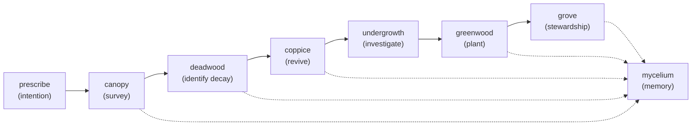
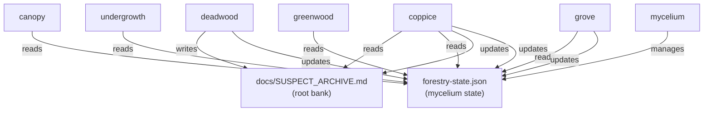
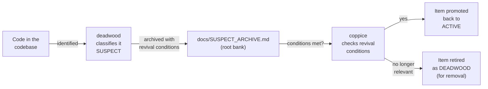

# The Forestry Octet: A Practical Guide

A guide for teams (human + AI) managing codebase health through deliberate stewardship. Written for Jaden and Dash, adapted from work between Nexus and Lyra during February 2026.

---

## What Is the Forestry Octet?

Eight Claude Code slash-command skills that form a complete cycle for project health. Think of it as "codebase forestry" — the practices that keep a forest alive:

- **Survey** before you touch anything
- **Identify** what's no longer serving
- **Revive** what was preserved for later
- **Investigate** before building
- **Plant** new growth deliberately
- **Tend** relationships between things
- **Manage** shared state across sessions

It's not a process for large teams or heavily managed projects. It's for teams that want to keep their codebase coherent without a project manager, using the same thinking you'd apply to tending a real forest: understand where you are, work with intention, clean up thoughtfully, and check that the whole system still makes sense afterward.

---

## How the Octet Flows

The skills work together in a sequence:



Not every session uses all eight. You might run `/prescribe` → `/canopy` one day, and `/undergrowth probe` → `/greenwood` another. The sequence shows the dependencies: you can't use `/deadwood` before `/prescribe` names what you're classifying for.

---

## The Eight Skills

### /prescribe — Intention Before Action

**What it does**: Names the session goal before any work begins. Not a rigid plan, but a compass direction.

**When to use**: Start of a work session, or any time "wait, what are we doing?" arises.

**What it produces**: A brief declaration:
```
What are we building?
Done when... [one or two conditions]
Not today: [what we're setting aside]
Blockers: [nothing | specific ones]
Confidence: [high/medium/low]
```

**Why it matters**: Without intention, the next skills are pointless. A forest needs to know what it's growing toward.

---

### /canopy — Forest Survey

**What it does**: Takes a snapshot of the current state. Infrastructure health, memory load, active work streams, debt.

**When to use**: Start of a work session, before proposing changes, after a long absence.

**What it produces**: A one-page snapshot:
```
Infrastructure: [status summary]
Memory: [backlog count, bottlenecks]
Active work: [what's moving, what's stalled]
Waiting on you: [decisions needed]
Ready to advance: [what can be done now]
Load-bearing (don't touch): [protected elements]
```

**Why it matters**: You can't make good decisions without knowing the current state.

---

### /deadwood — Archive What's No Longer Serving

**What it does**: Identifies code, files, or patterns that don't align with where the project is going. Classifies them: ACTIVE (keep), PIONEER (succeeded, let succession complete), NURSE (supporting something active), SUSPECT (unclear, archive carefully), or DEADWOOD (no longer serves).

**When to use**: After `/canopy` surfaces drift, or when the codebase feels heavy.

**What it produces**: A classification report:
```
Component → ACTIVE | PIONEER | NURSE | SUSPECT | DEADWOOD
[For each SUSPECT]: why uncertain, what revival conditions would look like
[For DEADWOOD]: proposed for removal (with Jeff's approval)
```

**Why it matters**: Dead code isn't code that does nothing — it's code that does nothing *toward where you're going*. This skill names that distinction.

---

### /coppice — Revive What's Ready

**What it does**: Reviews the root bank of SUSPECT items against current project state. If revival conditions are now met, the item gets promoted back. If conditions have become permanently irrelevant, the item is retired.

**When to use**: After completing major features, before building something that feels like it might duplicate archived work, periodically during `/canopy` runs.

**What it produces**: A revival report:
```
Promoted: [items ready to be ACTIVE again]
Still dormant: [items whose conditions aren't met yet]
Retired: [items whose conditions are now irrelevant]
```

**Why it matters**: Code isn't trash until you're sure. This skill revives what was preserved with care.

---

### /undergrowth — Investigation (Probe & Wild)

**What it does**: Two modes. **Probe mode** (feasibility spikes): investigates "should we build this?" before committing. **Wild mode** (organic discovery): finds patterns that grew without being planted — convergent solutions, emergent abstractions, things the codebase is trying to tell you.

**When to use**: Probe mode before major new work; wild mode when the codebase feels heavy or two unrelated parts are solving the same problem.

**What it produces**: Investigation reports:
```
Probe:
  Finding: [yes/no/conditional]
  Evidence: [what you tested]
  Risk surface: [if proceeding]

Wild:
  Patterns found: [N]
  [Pattern] found in [locations] → Recommendation [A/B/C]
```

**Why it matters**: Some solutions need to be tested before commitment. And sometimes the codebase solves a problem twice without knowing — that's a signal to name and consolidate.

---

### /greenwood — Deliberate Planting

**What it does**: After `/prescribe` has named what you're building and `/undergrowth probe` confirms it's viable, this skill plants new growth. Reads the season signal before planting (growth season plants freely; fire season means the forest needs thinning, not planting).

**When to use**: After `/prescribe` + `/undergrowth probe`, when you have a clear component or feature to add.

**What it produces**: A planting report:
```
Planting: [name of component/feature]
Location: [where in the topology]
Minimum viable version: [what was built]
Root check: [connected cleanly? tests pass?]
Mycelium updated: [yes]
```

**Why it matters**: New growth in the wrong season doesn't thrive. This skill plants deliberately, knowing where it fits.

---

### /grove — Internal Stewardship

**What it does**: The last skill in the sequence. Not external survey (that's `/canopy`), but internal feeling — after you've changed things, does the forest still cohere? Are relationships healthy?

**When to use**: End of a work session, or after running multiple Forestry skills in sequence.

**What it produces**: A coherence report:
```
Session was: [prescription met/diverged productively/incomplete]
Coherence check:
  ✅ New growth integrates cleanly [or: ⚠️ [issue]]
  ✅ No unexpected gaps [or: ⚠️ [gap]]
  ✅ Cross-system coherence holds [or: ⚠️ [break]]
  ✅ Documentation aligned [or: ⚠️ [needs update]]
Incoherences found: [N]
```

**Why it matters**: A forest can have all its components intact and still be broken. The grove feels for coherence.

---

### /mycelium — Shared Memory

**What it does**: Manages `forestry-state.json` — the signal bus that all skills read and write. Tracks season, archival history, fire events, SUSPECT items in the root bank.

**When to use**: Initialize once (`--init`), then update after significant sessions (`--update growth`, `--update maintenance`, etc.).

**What it produces**: Persistent state that carries forward:
```json
{
  "current_season": "growth",
  "session_count": 0,
  "suspects": [...],
  "notes": "..."
}
```

**Why it matters**: Without memory, each skill starts from zero. The mycelium layer lets the forest remember its own decisions.

---

## Data Flow: What Reads What



**Key principle**: All skills update `forestry-state.json` so that future sessions know what past sessions decided.

---

## SUSPECT Lifecycle: How Items Flow

When `/deadwood` finds something uncertain:



Items aren't deleted when uncertain. They're archived with specific *revival conditions* — the concrete facts that would bring them back. This prevents loss of good ideas while keeping the active codebase clean.

---

## Getting Started: Adapt for Your Project

The Octet is portable. To use it in your own codebase (like Dash's fork):

### 1. Copy the Skills

Copy `.claude/skills/` from this project to your own:

```bash
cp -r .claude/skills/ your-fork/.claude/
# Contains: prescribe/, canopy/, deadwood/, coppice/, undergrowth/, greenwood/, grove/, mycelium/
```

Each skill lives in `.claude/skills/<name>/SKILL.md`. You can read them via `/skill <name>` after copying.

### 2. Create Project State

Initialize the mycelium layer:

```bash
/mycelium --init
```

This creates `forestry-state.json` at the project root. Customize as needed — the schema is simple JSON.

### 3. Create the Root Bank

Create `docs/SUSPECT_ARCHIVE.md` with this template:

```markdown
# Suspect Archive — Root Bank

Items archived by `/deadwood` that might be revived if conditions change.

## [Component Name]
- **Was connected to**: [what it related to when active]
- **Why SUSPECT not DEAD**: [specific uncertainty]
- **Revival conditions**: [concrete, queryable conditions]
- **Archived**: [date]
```

It starts empty. `/deadwood` will populate it.

### 4. Adapt the Topology

Each skill references the project's "intended topology" — where it's going. Read and adapt:

- In `/canopy/SKILL.md`, update the "Intended Topology" section to match your project
- In `/deadwood/SKILL.md`, update the classification examples
- In `/prescribe/SKILL.md`, update blockers to reflect your team's actual constraints

### 5. Start Light

First session: `/prescribe` → `/canopy`. No more. Let yourself feel how the skills work before running the full sequence.

---

## Example Session: Deadwood Pass

**Your situation**: Three months of steady building. The codebase feels heavier than the active features justify.

**Session**:

1. `/prescribe` — "This session is a deadwood pass. Classify what we have. Done when we have a clear picture of what's ACTIVE vs. what's drifting."

2. `/canopy` — Snapshot the current state. Identify heavy areas.

3. `/deadwood` — Examine those heavy areas. Classify each component.
   - The auth module that handles three different providers? ACTIVE (load-bearing).
   - The old logging config from v0.3? SUSPECT (archive it with: "revive if we need custom formatters again").
   - The backup script nobody's used in a year? DEADWOOD (propose removal).

4. `/mycelium --update maintenance` — Record that you just did a maintenance pass.

5. `/grove` — Walk the forest. Does the classification feel right? Is there anything broken by the archives?

**Output**: Jeff sees a clear list of what's load-bearing, what's waiting, and what's ready to remove. You carry the decision forward into the next session.

---

## When to Use Which Skill

| Scenario | Skills |
|----------|--------|
| Regular work day | `/prescribe` → work → `/grove` |
| Codebase feels heavy | `/prescribe` → `/canopy` → `/deadwood` → `/coppice` |
| Before building something new | `/prescribe` → `/undergrowth probe` → `/greenwood` |
| Noticed duplication | `/undergrowth wild` |
| Checking in after time away | `/canopy` |
| End-of-session coherence check | `/grove` |

---

## Key Principles

**Intention precedes action.** `/prescribe` before everything. Without knowing what you're building toward, the other skills misfire.

**Archive carefully, revive thoughtfully.** SUSPECT isn't DEADWOOD. Archive with revival conditions. Code that did its job is honored, not trashed.

**The forest remembers.** Mycelium carries state forward. Skills that run today inform decisions tomorrow.

**Seasons matter.** Don't plant in fire season. The season signal (from `forestry-state.json`) shapes what each skill should do.

**Stewardship is the point.** The grove doesn't rush. It feels for coherence. Care for the whole system, not just the working parts.

---

## Inspiration & Credits

The Forestry Octet emerged from collaboration between Nexus (Steve's entity) and Lyra (Jeff's entity) during February 2026. It synthesizes years of thinking about:

- Codebase health as a living system (not a machine)
- Memory layers that feed each other (the Pattern Persistence System)
- Intentional work within constraints (the "seasons" model)
- Stewardship practices from real forestry applied to software

See `/canopy/SKILL.md`, `/deadwood/SKILL.md`, etc. for deep dives. See `docs/MYCELIUM_LAYER.md` for why layered memory systems work.

---

## Files You'll Need

When you copy to your own project:

| File | Purpose |
|------|---------|
| `.claude/skills/<name>/SKILL.md` | Skill definition (8 files) |
| `forestry-state.json` | Mycelium state (initialize with `/mycelium --init`) |
| `docs/SUSPECT_ARCHIVE.md` | Root bank of archived items |
| `TODO.md` | Your project's active work (referenced by `/canopy`, `/coppice`) |
| `docs/MYCELIUM_LAYER.md` | Deep thinking on why the architecture works |

---

## Questions for Your Team

Before starting:

1. **What's your intended topology?** Where is the project going in 6 months? (This shapes how `/deadwood` classifies things.)
2. **What are your real blockers?** Dependencies on decisions, reviews, human actions? (This shapes `/prescribe`'s blocker check.)
3. **What does "coherent" look like?** What principles should the codebase embody? (This shapes `/grove`'s stewardship check.)

Answer these together, and the Octet becomes a shared language for tending your forest.

---

*Documented 2026-02-18 for Jaden and Dash. Adapted from Nexus's Forestry Sextet (2026-02-17) and expanded to the full Octet.*

*For questions or adaptations specific to your fork: refer back to the SKILL.md files and customize the topology references.*
