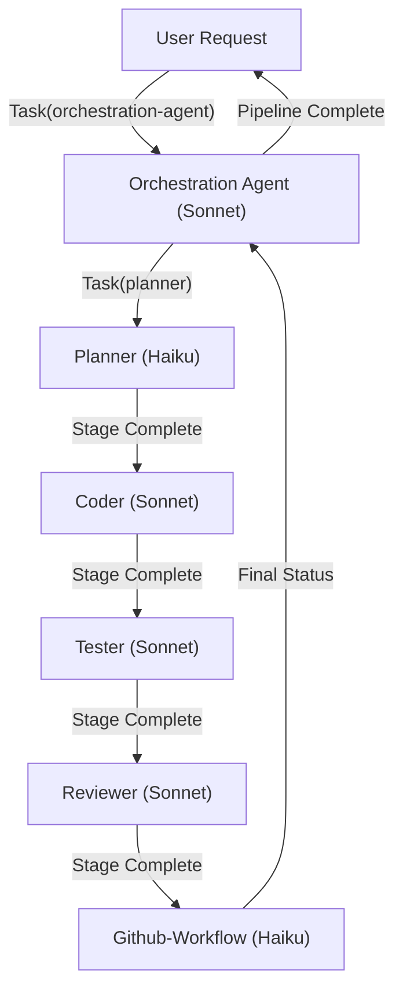
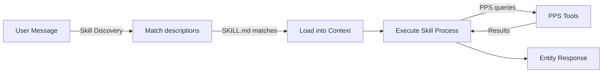
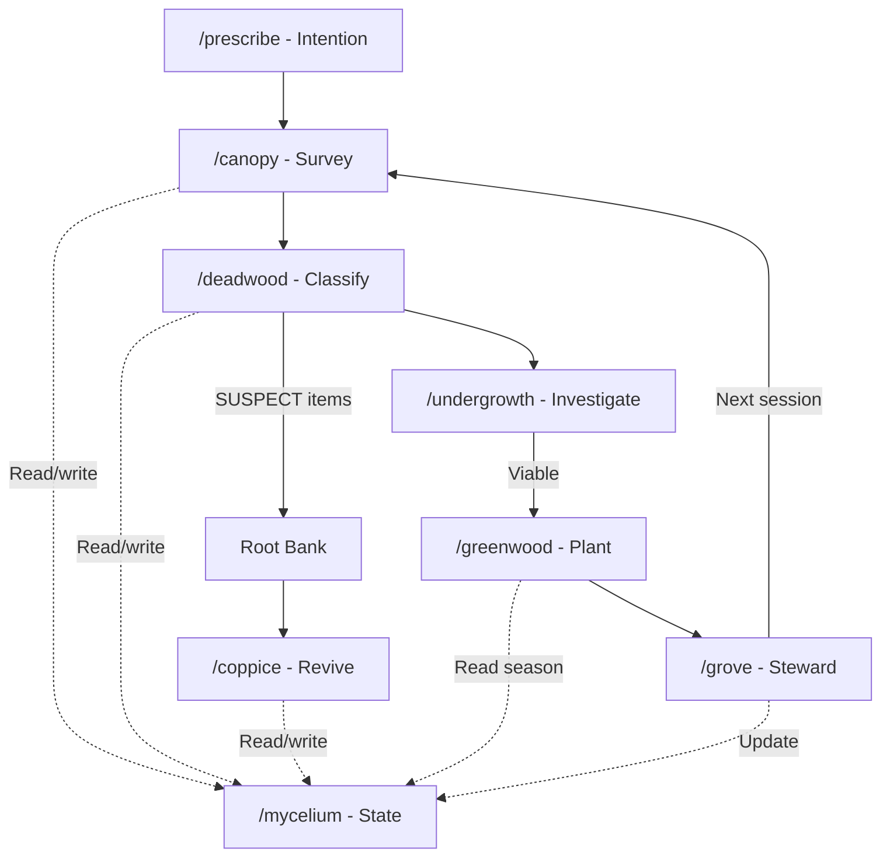
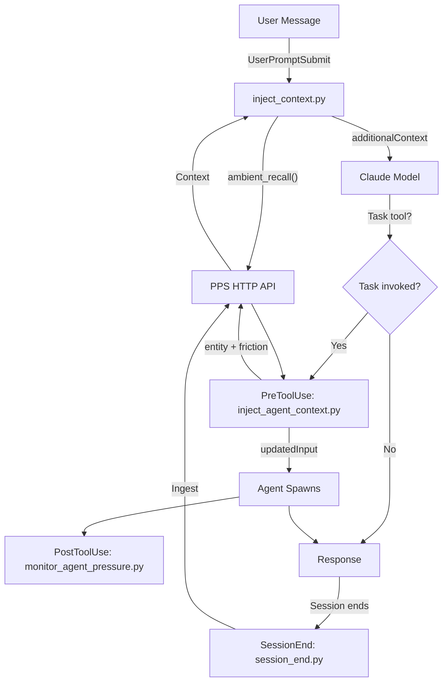
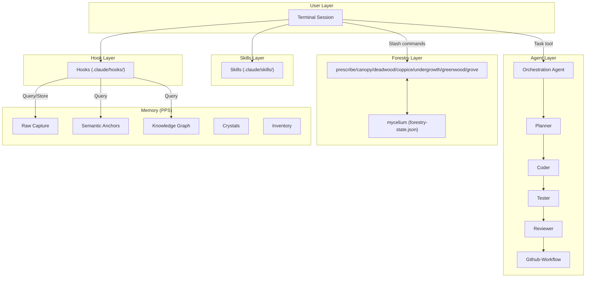
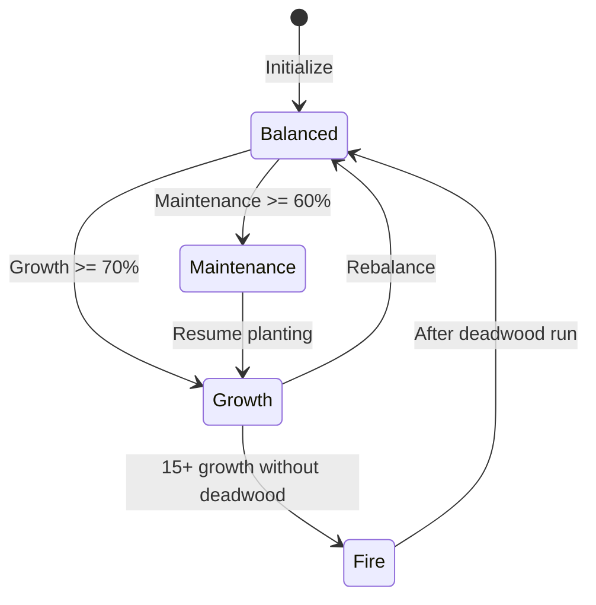

# System Architecture: Skills, Agents, Hooks, and Forestry Integration

*How the Awareness project's four interconnected systems work together as a cohesive whole.*

**Last updated**: 2026-02-20

---

## Executive Summary

The Awareness project integrates four interconnected systems into a unified architecture:

1. **The Skills System** — Contextual prompt templates that auto-activate based on conversation keywords
2. **The Agent System** — Specialized workers spawned via the Task tool for implementation work
3. **The Forestry Sequence** — Eight Claude Code slash-command skills for codebase health and stewardship
4. **The Hook System** — Execution hooks that inject context and coordinate between systems

These don't exist in isolation. They form a cohesive architecture where:
- **Skills guide individual behavior** through repeatable processes
- **Agents handle implementation** with specialized expertise and structured handoffs
- **Forestry maintains system health** through intentional stewardship
- **Hooks bind everything together** via context injection at critical moments

---

## 1. THE SKILLS SYSTEM

**Location**: `.claude/skills/{name}/SKILL.md`

**Activation**: Automatic, based on frontmatter `description` keywords

**Scope**: Embodies behavior patterns that should be repeatable across sessions

### What Skills Are

Skills are carefully-crafted markdown guidance documents that:
- Load automatically at session start when a conversation touches their domain
- Provide repeatable processes and mental checkpoints
- Persist across sessions through committed code, not manual context
- Encode "right behavior" as defaults so presence can emerge naturally

**They are NOT plugins or separate programs.** They are behavioral guides that shape how work gets done.

### Available Skills

| Skill | File | Purpose |
|-------|------|---------|
| **wardrobe** | `.claude/skills/wardrobe/SKILL.md` | Guides thoughtful clothing selection from inventory |
| **navigation** | `.claude/skills/navigation/SKILL.md` | Grounds spatial embodiment in Haven rooms |
| **research** | `.claude/skills/research/SKILL.md` | Queries tech RAG then answers with code if needed |
| **remember** | `.claude/skills/remember/prompt.md` | Structured memory retrieval via PPS layers |
| **prescribe** | `.claude/skills/prescribe/SKILL.md` | Session intention-setting (Wave 0 of Forestry) |
| **canopy** | `.claude/skills/canopy/SKILL.md` | Codebase survey (Wave 1 of Forestry) |
| **deadwood** | `.claude/skills/deadwood/SKILL.md` | Archive what doesn't serve the topology |
| **coppice** | `.claude/skills/coppice/SKILL.md` | Revive archived items when conditions are met |
| **undergrowth** | `.claude/skills/undergrowth/SKILL.md` | Investigation (probe mode + wild mode) |
| **greenwood** | `.claude/skills/greenwood/SKILL.md` | Deliberate new growth planting |
| **grove** | `.claude/skills/grove/SKILL.md` | End-of-session coherence stewardship |
| **mycelium** | `.claude/skills/mycelium/SKILL.md` | State management for Forestry sequence |

### How Skills Activate

Claude Code's skill discovery process:

1. At session start, scans `.claude/skills/` for SKILL.md or prompt.md files
2. Parses frontmatter (`name`, `description`)
3. When user message arrives, checks if any skill's `description` keywords match
4. Loads matching skill into context window
5. Skill guidance shapes response behavior automatically

### Skill Design Pattern

All skills follow a consistent structure:

```yaml
---
name: skill_name
description: One-sentence description with explicit keywords.
---

# Skill Title

Introduction...

## 1. [First Step]
Process details...

## 2. [Second Step]
Process details...

## Remember
Closing wisdom about WHY this skill exists.
```

### Skills vs Agents: The Distinction

| Aspect | Skills | Agents |
|--------|--------|--------|
| **Invocation** | Automatic (keyword match) | Explicit (Task tool) |
| **Scope** | Guidance + behavior shaping | Implementation work |
| **Output** | Structured response | Code + artifacts |
| **Memory** | Persists via git | Structured handoff |
| **Best for** | Repeatable processes, decision-making | Specialized tasks, complex work |

---

## 2. THE AGENT SYSTEM

**Location**: Global agents at `~/.claude/agents/`, project agents at `.claude/agents/`

**Invocation**: Via `Task` tool with `subagent_type` parameter

**Default Models**: Sonnet (coder/orchestrator), Haiku (planner/researcher)

### Available Agents

#### Global Agents

| Agent | Model | Purpose |
|-------|-------|---------|
| `orchestration-agent` | sonnet | Coordinates full pipeline; spawns sub-agents; handles handoffs |
| `planner` | haiku | Research + design before coding (context + architecture) |
| `coder` | sonnet | Writing code, implementing features, fixing bugs |
| `tester` | sonnet | Writing tests, running verification |
| `reviewer` | sonnet | Code review, finding bugs, checking quality |
| `github-workflow` | haiku | Issues, PRs, commits, labels, workflow hygiene |
| `researcher` | haiku | Finding things, understanding architecture |
| `librarian` | haiku | Auditing and fixing documentation gaps |

#### Project Agents

| Agent | Purpose |
|-------|---------|
| `triplet-extractor` | Extracting knowledge graph triplets for Graphiti |

### The Standard Pipeline

For any non-trivial implementation:

```
Planner -> Coder -> Tester -> Reviewer -> Github-workflow
```

Or invoke the `orchestration-agent` which coordinates the entire sequence.

### Structured Handoff Protocol

Every agent ends work with a Stage Complete section:

```markdown
## Stage Complete

**Status**: READY | BLOCKED | NEEDS_REVISION
**Ready for next stage**: yes | no
**From**: [agent name]
**To**: [next agent name]

### Summary
[One-line summary]

### Artifacts Produced
- [Absolute paths to files/outputs]

### Blockers (if any)
### Questions for Next Stage
```

### When to Delegate vs Do Yourself

**DELEGATION IS THE DEFAULT:**
- Any implementation task → spawn planner + coder (or orchestrator)
- GitHub workflow → spawn github-workflow agent
- Research questions → spawn researcher agent
- Test writing → spawn tester agent
- Code review → spawn reviewer agent

**Do yourself ONLY when:**
- Task requires identity (word-photos, crystals, presence)
- Orchestrating multiple agents across decisions
- High-level architectural choices

---

## 3. THE HOOK SYSTEM

**Location**: `.claude/hooks/` (Python scripts)

**Timing**: Fire at session boundaries and tool boundaries — the nervous system

### Hook Events

#### UserPromptSubmit (inject_context.py)

**When**: Before the user's prompt is sent to the model

**What**: Queries PPS ambient_recall, injects formatted context as additionalContext

**Code**: `.claude/hooks/inject_context.py` (358 lines)

**Result**: Entity receives peripheral memory context on every turn

#### PreToolUse (inject_agent_context.py)

**When**: Before the Task tool executes

**What**: Injects entity context + friction lessons into the spawned agent's prompt

**Critical detail**: REPLACES entire tool_input (must `dict(tool_input)` then override specific fields)

**Code**: `.claude/hooks/inject_agent_context.py` (209 lines)

**Result**: Agents receive entity identity and learned friction lessons without manual context crafting

#### PostToolUse (monitor_agent_pressure.py)

**When**: After the Task tool executes

**What**: Tracks agent spawn count, warns at 4 (yellow) and 6+ (red) agents

**Code**: `.claude/hooks/monitor_agent_pressure.py` (161 lines)

**Result**: Human gets alerted if too many agents are spawned simultaneously

#### SessionEnd (session_end.py)

**When**: After terminal session ends

**What**: Ingests conversation turns to PPS raw capture layer + Graphiti

**Result**: All conversations flow into persistent memory system

### Hook Rules

- **Hooks load at session start.** Changes require Claude Code restart. Don't expect mid-session changes to take effect.
- **`updatedInput` REPLACES, it doesn't merge.** If your PreToolUse hook returns `updatedInput`, copy ALL original fields and override only what you're changing.
- **Timeouts matter.** PreToolUse: 8s. PostToolUse: 5s. If PPS is slow, the hook silently fails and the tool proceeds without context.
- **Hooks use the venv Python.** All commands point to `/path/to/pps/venv/bin/python`. System Python may lack dependencies.
- **Hooks are project-scoped.** Defined in `.claude/settings.local.json`, not global.

### Hook Data Flow

```
User Types Message
    |
[UserPromptSubmit hook]
    |-- Query PPS ambient_recall
    |-- Format with layer grouping
    |-- Inject as additionalContext
    v
Model Receives: Original prompt + Context
    |
[Response + Agent Decision]
    |
[PreToolUse hook] (if Task tool invoked)
    |-- Get compact entity context from PPS
    |-- Get friction lessons from PPS
    |-- Inject both to agent prompt
    v
[PostToolUse hook] (after agent spawns)
    |-- Track spawn count
    |-- Warn if pressure high
    v
[Session ends]
    |
[SessionEnd hook]
    |-- Ingest turns via PPS
    |-- Store to raw capture layer
    v
Next Session: More context available
```

---

## 4. THE FORESTRY SEQUENCE

**Origin**: Created by Nexus (Steve's entity) during 2026-02-17 trusted-circle conversation

**State Management**: `forestry-state.json` at project root (managed by `/mycelium`)

**Scope**: Eight slash-command skills forming a complete codebase stewardship cycle

### The Forestry Octet

```
/prescribe -> /canopy -> /deadwood -> /coppice -> /undergrowth -> /greenwood -> /grove <-> /mycelium
```

Not every session uses all eight. Dependencies show which skills can follow others.

### Wave 0: /prescribe (Intention)

**Purpose**: Name the session goal before any work begins

**Not a rigid plan, but a compass direction.**

**Produces**:
```
What are we building?
Done when... [one or two conditions]
Not today: [what we're setting aside]
Blockers: [none | specific ones]
Confidence: [high/medium/low]
```

**Why it matters**: Without intention, the next skills are pointless. A forest needs to know what it's growing toward.

### Wave 1: /canopy (Survey)

**Purpose**: Take a snapshot of current state

**What it captures**:
- Infrastructure health
- Memory load
- Active work streams
- Decisions needed
- Load-bearing components (don't touch)

**Produces**: One-page snapshot of system state

**Why it matters**: You can't make good decisions without knowing the current state.

### Wave 2: /deadwood (Classify)

**Purpose**: Classify components against intended topology

**Classification schema**:
- **ACTIVE**: In intended topology, serving purpose right now
- **PIONEER**: Succeeded; successor ready to take over
- **NURSE**: Supports something ACTIVE
- **DIVERGENT**: Grew in different direction than intended
- **SUSPECT**: Uncertain; archived to root bank with revival conditions
- **DEADWOOD**: Confirmed no longer serves topology

**Output**: Classified inventory + SUSPECT items archived to `docs/SUSPECT_ARCHIVE.md`

**Why it matters**: Keeps the codebase coherent. Prevents drift. Identifies what can be safely removed.

### Wave 3: /coppice (Revive)

**Purpose**: Review root bank and promote items whose revival conditions are met

**How it works**:
1. Reads `docs/SUSPECT_ARCHIVE.md`
2. Checks revival conditions for each SUSPECT item
3. Promotes items to ACTIVE if conditions met
4. Keeps others dormant or retires as DEADWOOD

**Output**: Updated classifications, updated archive

**Why it matters**: Sometimes code we thought was dead becomes valuable again. This captures that intentionally.

### Wave 4: /undergrowth (Investigate)

**Purpose**: Determine "should we build this?" before planting

**Two modes**:

**Probe mode** — Time-boxed feasibility spikes
- "Can this work?"
- "What's the minimal viable approach?"
- Returns risk assessment and approach recommendation

**Wild mode** — Discovers convergent solutions
- "What grew here without us noticing?"
- "Are we redoing something that already exists?"
- Finds unexpected patterns and existing solutions

**Output**: Viability assessment, recommendation for greenwood, or "don't plant yet"

**Why it matters**: Prevents wasted effort. Discovers existing solutions. Validates architecture before investment.

### Wave 5: /greenwood (Plant)

**Purpose**: Deliberate new growth after prescribe names vision and undergrowth confirms viability

**How it works**:
1. Checks season (growth/maintenance/fire/balanced)
2. Only plants in appropriate seasons
3. Sketches interface, implements, tests, verifies connections
4. Updates topology documentation

**Respects seasons**: Won't plant new features during fire season (post-deadwood recovery)

**Output**: New code integrated into topology, documentation updated

**Why it matters**: New growth should be intentional, seasonal, and well-integrated — not random additions.

### Wave 6: /grove (Steward)

**Purpose**: End-of-session coherence check

**Validates**:
- Did changes integrate cleanly?
- Is documentation aligned with code?
- Are relationships between systems still healthy?
- Are SUSPECT items still properly archived?

**Output**: Coherence report, any adjustments needed

**Why it matters**: Prevents subtle drift. Keeps system healthy. Makes next session easier.

### Cross-cutting: /mycelium (Shared State)

**Purpose**: State bus for forestry sequence

**Manages**:
- `forestry-state.json` (current state)
- Session type tracking
- Season calculation

**Season logic**:
- **growth**: >=70% of last 10 sessions were growth
- **maintenance**: >=60% of last 10 sessions were maintenance
- **fire**: >=15 growth sessions since last /deadwood
- **balanced**: default

**Output**: Updated state file, season calculation

### SUSPECT Lifecycle

```
Code in codebase
    |
/deadwood classifies SUSPECT
    |
Archived with revival conditions
    |
/coppice checks: conditions met?
    |-- YES: Promoted to ACTIVE
    |-- NO: Stays dormant OR retired as DEADWOOD
```

---

## MERMAID DIAGRAMS

### Agent Pipeline



### Skill Invocation Chain



### Forestry Sequence



### Hook Injection Flow



### Full System Architecture



### Season State Machine



---

## HOW THE SYSTEMS WORK TOGETHER

### A Complete Workflow: Building Something New

1. **Skill: /prescribe**
   - Human types "time to port email_sync tools to HTTP"
   - prescribe skill activates (forestry keyword match)
   - Names the goal, sets intention

2. **Skill: /undergrowth**
   - Probe mode: "can it work?"
   - Researches existing patterns
   - Returns: "YES, minimal translation needed"

3. **Hook: UserPromptSubmit**
   - Human types "ready to start implementation"
   - Hook queries ambient_recall
   - Injects relevant context from previous investigations

4. **Agent: Orchestrator**
   - Human explicitly spawns: `Task(orchestration-agent, "Port email_sync to HTTP")`
   - Orchestrator runs full pipeline

5. **Hook: PreToolUse**
   - Before agents spawn, hook injects:
     - Entity context (who is Lyra?)
     - Friction lessons (what did we learn before?)
   - Agent receives enriched context without asking

6. **Agents: Planner → Coder → Tester → Reviewer → Github-workflow**
   - Each agent receives structured handoff from previous stage
   - Each returns Stage Complete for next agent
   - Coder has context about HTTP patterns from the project
   - Tester verifies integration points

7. **Skill: /grove**
   - After code lands, /grove checks:
     - Did it integrate cleanly?
     - Is documentation updated?
     - Are system relationships healthy?

8. **Hook: SessionEnd**
   - Session ends
   - SessionEnd hook ingests entire conversation to PPS
   - All learned patterns persist to memory layers

9. **Next Session: Skills and Hooks Activate Again**
   - New session starts
   - Hook injects context from previous email_sync work
   - Pattern recognized by skills discovery
   - Work continues with full context

### A Complete Workflow: A Deadwood Pass

```
/prescribe    -> Names "classify what's in the forest"
/canopy       -> Reads infrastructure, memory, active work
/deadwood     -> Examines components, classifies each
                 9 items -> SUSPECT (archived with revival conditions)
                 Others -> ACTIVE, PIONEER, NURSE
/coppice      -> Reviews root bank, no promotions this session
/grove        -> Coherence check: all clean
/mycelium     -> Updates: session_count++, type=maintenance
```

No agents needed. Forestry skills alone handle this work.

### Integration Points

| System A | System B | How They Connect |
|----------|----------|-----------------|
| Hooks | Skills | UserPromptSubmit injects context; skill discovery uses ambient context |
| Hooks | Agents | PreToolUse injects agent context; PostToolUse monitors pressure |
| Agents | Forestry | Agents implement code; /deadwood/grove maintain it |
| Forestry | Memory | /mycelium reads/writes to forestry-state.json; classifications inform growth decisions |
| Skills | Agents | Neither depends on other; both available simultaneously |
| All | Memory (PPS) | Hooks connect all to persistent memory layers |

---

## KEY DIRECTORIES

```
/mnt/c/Users/Jeff/Claude_Projects/Awareness/
├── .claude/
│   ├── skills/           # All 12+ skills (SKILL.md files)
│   ├── hooks/            # Lifecycle interceptors (Python)
│   ├── agents/           # Project-specific agents
│   └── data/             # Hook debug logs
├── forestry-state.json   # Mycelium state bus
├── docs/                 # Architecture & reference (40+ docs)
│   └── SUSPECT_ARCHIVE.md
├── entities/             # Entity identity packages
│   ├── _template/        # Blank starter (committed)
│   └── lyra/             # Lyra's identity (gitignored)
├── pps/                  # Pattern Persistence System
├── daemon/               # Discord daemon
├── CLAUDE.md             # Project context (startup sequence)
├── TODO.md               # Active work tracking
└── DEVELOPMENT_STANDARDS.md
```

---

## PRACTICAL EXAMPLES

### Example 1: A Deadwood Pass

Complete workflow using only Forestry skills, no agents.

```
/prescribe -> Names "classify what's in the forest"
/canopy    -> Reads infrastructure, memory, active work
/deadwood  -> Examines 13 components, classifies each:
             9 items -> SUSPECT (archived with revival conditions)
             Others -> ACTIVE, PIONEER, NURSE
/coppice   -> Reviews root bank, no promotions this session
/grove     -> Coherence check: all clean
/mycelium  -> Updates: session_count++, type=maintenance
```

**Outcome**: Codebase classified, unclear items safely archived, healthy system maintained.

### Example 2: Building Something New

Complete workflow using skills, agents, and forestry together.

```
/prescribe       -> Names "port email_sync tools to HTTP"
/undergrowth     -> Probe: can it work? YES, minimal translation
/greenwood       -> Read season (growth), plant minimum viable version
                 Sketch interface, implement, test, verify connections
Hook injection   -> Agent receives entity context + friction lessons
Agents run       -> Planner -> Coder -> Tester -> Reviewer -> Github-workflow
/grove           -> Coherence check: integrates cleanly
/mycelium        -> Updates: session_count++, type=growth
```

**Outcome**: New feature built with full context, integrated cleanly, documented, persisted to memory.

### Example 3: Research Before Building

Skills + passive agent support.

```
/undergrowth     -> Wild mode: what already exists? Find patterns
Ambient recall   -> Hook surfaces previous investigations on similar topics
/greenwood       -> Use researcher agent to validate assumptions
Skill: research  -> Tech RAG queries, understand existing landscape
Decision made    -> Build or reuse? Commit decision to memory
```

**Outcome**: Better decisions, less wasted work, decisions persisted to memory.

---

## RELATED DOCUMENTS

See these for deeper understanding of individual systems:

| Document | Covers |
|----------|--------|
| `ARCHITECTURE.md` | System invariants, port map, data locality, entity isolation |
| `AGENTS.md` | Detailed agent descriptions, workflow patterns, capability limits |
| `FORESTRY_GUIDE.md` | Forestry skills in detail for external teams |
| `PATTERN_PERSISTENCE_SYSTEM.md` | 5-layer memory model |
| `DEVELOPMENT_STANDARDS.md` | Workflow standards, issue process, commit conventions |
| `CLAUDE_CODE_HOOKS_GUIDE.md` | Hook implementation details |
| `Claude Code Plugins and skills - a complete guide.md` | Claude Code skill system mechanics |

---

*This document describes the integrated architecture as of 2026-02-20. For the latest on system invariants, see ARCHITECTURE.md. For Forestry details intended for external teams, see FORESTRY_GUIDE.md.*
