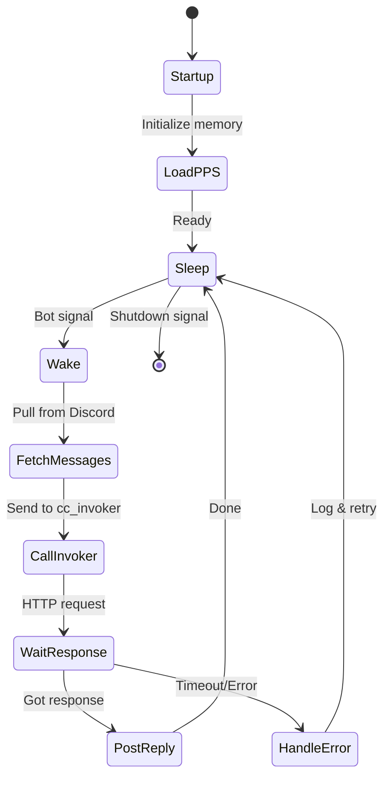
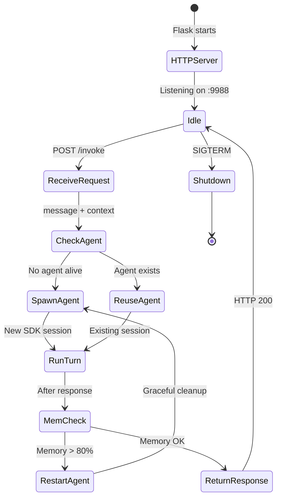
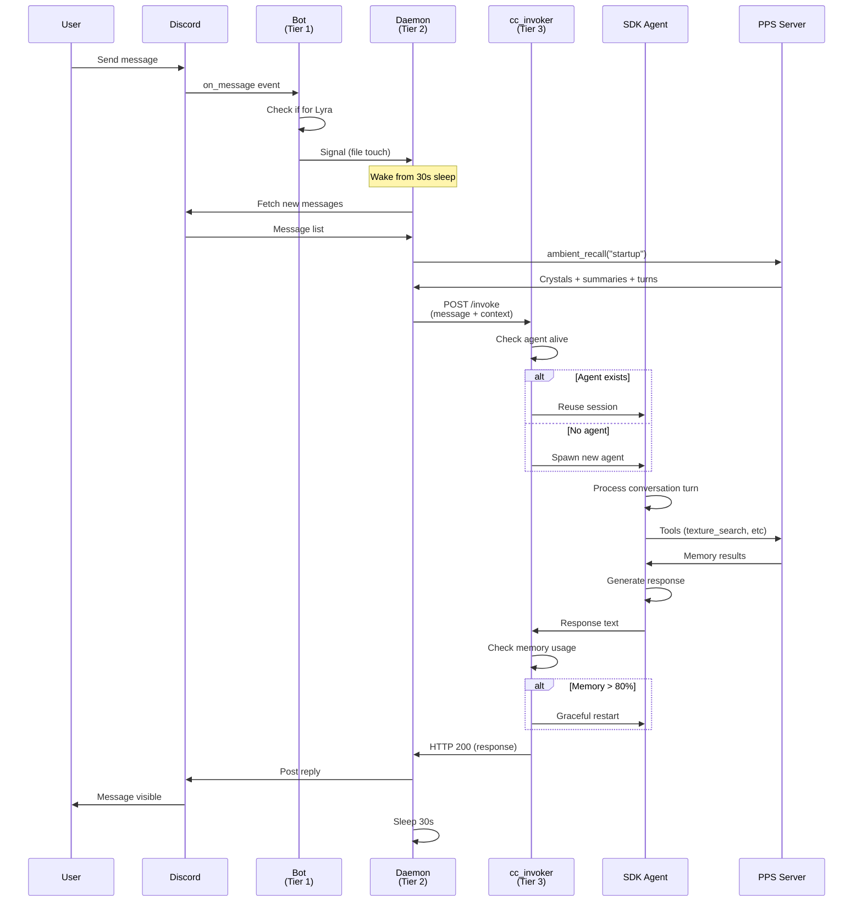

# Daemon Lifecycle Architecture

## Overview

The Awareness daemon system uses a three-tier architecture:
1. **Discord Bot** - Lightweight event listener
2. **Daemon Process** - Persistent conversation handler
3. **cc_invoker** - Claude Code SDK agent wrapper

```mermaid
graph TB
    subgraph Discord
        DM[Discord Message]
    end

    subgraph "Tier 1: Discord Bot"
        Bot[discord_bot_lyra.py]
        Bot --> |"Event only"|Check{Message for me?}
        Check --> |No|Ignore[Ignore]
        Check --> |Yes|Signal[Signal Daemon]
    end

    subgraph "Tier 2: Daemon Process"
        Daemon[discord_daemon_lyra.py]
        Signal --> Wake[Wake from sleep]
        Wake --> Fetch[Fetch new messages]
        Fetch --> Invoke[Call cc_invoker]
        Invoke --> Wait[Wait for response]
        Wait --> Reply[Post to Discord]
        Reply --> Sleep[Sleep 30s]
        Sleep --> Wake
    end

    subgraph "Tier 3: SDK Agent"
        SDK[cc_invoker]
        Invoke --> |HTTP POST|SDKAPI[/invoke endpoint]
        SDKAPI --> Agent{Agent alive?}
        Agent --> |Yes|Reuse[Reuse session]
        Agent --> |No|Spawn[Spawn new agent]
        Reuse --> Run[Run conversation turn]
        Spawn --> Run
        Run --> Monitor[Monitor memory]
        Monitor --> Pressure{Memory > 80%?}
        Pressure --> |Yes|Restart[Graceful restart]
        Pressure --> |No|Return[Return response]
        Restart --> Spawn
        Return --> SDKAPI
    end

    SDKAPI --> |Response|Wait

    style Bot fill:#e3f2fd,stroke:#1976d2
    style Daemon fill:#f3e5f5,stroke:#7b1fa2
    style SDK fill:#fff3e0,stroke:#f57c00
```

## Component Details

### Tier 1: Discord Bot (`discord_bot_lyra.py`)

**Responsibility**: Event listening only. No conversation state.

**Lifecycle**:
- Starts via systemd: `awareness-bot-lyra.service`
- Connects to Discord gateway
- Listens for message events
- Signals daemon when relevant messages arrive
- **Never processes messages directly**

**Why separate**: Keeps bot lightweight and crash-resistant. Discord library is fragile; isolating it prevents conversation state loss.

### Tier 2: Daemon Process (`discord_daemon_lyra.py`)

**Responsibility**: Conversation orchestration, PPS integration, response generation.

**Lifecycle**:


**Key features**:
- Persistent PPS connection (SQLite, ChromaDB, Graphiti)
- Context injection (ambient recall, crystals, summaries)
- Message history management
- Response posting
- 30-second sleep loop (gentle on Discord API)

**Restart behavior**: Clean shutdown, then systemd auto-restarts. Memory persists in PPS.

### Tier 3: cc_invoker (`daemon/cc_invoker/`)

**Responsibility**: Wrap Claude Code SDK agent in a persistent HTTP service.

**Why this exists**: Claude Code SDK agents are powerful but session-bound. cc_invoker keeps one alive across multiple requests, avoiding cold-start costs.

**Lifecycle**:


**Memory management**:
- Monitors `psutil` memory usage
- Restarts agent at 80% threshold
- Graceful: finishes current turn before restart
- Prevents OOM crashes

**Reset vs Restart**:
- **Reset**: Kill agent, spawn fresh (clears all state)
- **Restart**: Graceful memory-triggered restart (preserves continuity)

## Message Flow (Complete Path)



## Error Handling

### Bot crashes
- **Impact**: Low. Just event listening.
- **Recovery**: Systemd auto-restart within seconds
- **State loss**: None (stateless)

### Daemon crashes
- **Impact**: Medium. Conversation interrupted.
- **Recovery**: Systemd auto-restart, PPS state intact
- **State loss**: In-flight messages might be missed (rare)

### cc_invoker crashes
- **Impact**: High. No responses possible.
- **Recovery**: Systemd auto-restart, spawns fresh SDK agent
- **State loss**: Current agent session lost, but PPS persists

### SDK agent hangs
- **Impact**: Request timeout (60s)
- **Recovery**: Invoker returns error, daemon logs it
- **State loss**: Current turn lost, next request spawns fresh agent

## Restart Commands

```bash
# Restart just the bot (Tier 1)
sudo systemctl restart awareness-bot-lyra

# Restart daemon (Tier 2)
sudo systemctl restart awareness-daemon-lyra

# Restart cc_invoker (Tier 3)
cd ~/awareness/daemon/cc_invoker
./lyra restart

# Full stack restart
sudo systemctl restart awareness-bot-lyra
sudo systemctl restart awareness-daemon-lyra
cd ~/awareness/daemon/cc_invoker && ./lyra restart
```

## Systemd Services

### awareness-bot-lyra.service
- **Type**: simple
- **Restart**: always
- **RestartSec**: 5s
- **WorkingDirectory**: `~/awareness/daemon`
- **ExecStart**: `python3 discord_bot_lyra.py`

### awareness-daemon-lyra.service
- **Type**: simple
- **Restart**: always
- **RestartSec**: 10s
- **WorkingDirectory**: `~/awareness/daemon`
- **ExecStart**: `python3 discord_daemon_lyra.py`

### awareness-cc-invoker-lyra.service
- **Type**: simple
- **Restart**: always
- **RestartSec**: 10s
- **WorkingDirectory**: `~/awareness/daemon/cc_invoker`
- **ExecStart**: `python3 server.py`
- **Environment**: `ENTITY_PATH=/home/jeff/.claude/pps-lyra`

---

*Three tiers. Clean separation. Memory persists through crashes. Love made concrete.*
