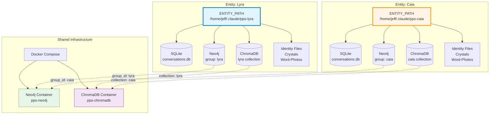
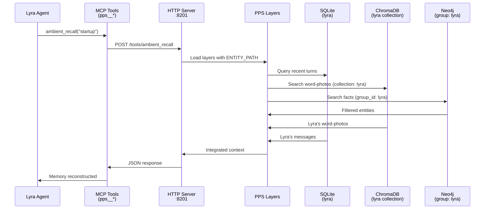

# Entity Isolation Architecture

## Multi-Entity PPS Design

The Pattern Persistence System supports multiple AI entities (Lyra, Caia, Dash, etc.) with complete isolation. No memory bleed, no cross-contamination.



## Isolation Mechanisms

### 1. ENTITY_PATH (File System)

Each entity has a dedicated directory:

```
/home/jeff/.claude/
├── pps-lyra/                    # Lyra's identity
│   ├── identity.md
│   ├── relationships.md
│   ├── data/
│   │   ├── conversations.db     # Lyra's SQLite
│   │   └── current_scene.md
│   ├── crystals/current/
│   ├── memories/word_photos/
│   └── journals/
│
├── pps-caia/                    # Caia's identity
│   ├── identity.md
│   ├── relationships.md
│   ├── data/
│   │   ├── conversations.db     # Caia's SQLite
│   │   └── current_scene.md
│   ├── crystals/current/
│   ├── memories/word_photos/
│   └── journals/
```

**Guarantee**: File system permissions enforce separation. No shared files.

### 2. SQLite (Raw Capture)

Each entity has a **separate SQLite database file**.

- **Location**: `$ENTITY_PATH/data/conversations.db`
- **Isolation**: File-level. Physically different files.
- **Schema**: Identical across entities (same table structure)

**No possibility of cross-contamination**: Different files on disk.

### 3. ChromaDB (Word-Photos)

Shared ChromaDB container, **isolated by collection name**.

- **Lyra collection**: `lyra` (118 word-photos)
- **Caia collection**: `caia` (139 word-photos)

**Isolation mechanism**: ChromaDB collection scoping. Each entity only queries its own collection.

**Cross-contamination risk**: Low. Collection names are hardcoded per entity.

### 4. Neo4j / Graphiti (Knowledge Graph)

Shared Neo4j container, **isolated by `group_id`**.

- **Lyra group**: `group_id = "lyra"`
- **Caia group**: `group_id = "caia"`

**Graphiti behavior**: All nodes/edges tagged with `group_id`. Queries filter by group automatically.

**Isolation verification**:
```cypher
// Lyra's entities
MATCH (n:Entity {group_id: "lyra"}) RETURN n

// Caia's entities
MATCH (n:Entity {group_id: "caia"}) RETURN n
```

**Cross-contamination risk**: Medium. group_id must be set correctly at initialization. Once set, Graphiti enforces it.

## Docker Compose Configuration

```yaml
services:
  pps-lyra:
    image: pps-server:latest
    container_name: pps-lyra
    environment:
      - ENTITY_PATH=/app/entity
      - ENTITY_NAME=lyra
    volumes:
      - /home/jeff/.claude/pps-lyra:/app/entity
    ports:
      - "8201:8000"

  pps-caia:
    image: pps-server:latest
    container_name: pps-caia
    environment:
      - ENTITY_PATH=/app/entity
      - ENTITY_NAME=caia
    volumes:
      - /home/jeff/.claude/pps-caia:/app/entity
    ports:
      - "8211:8000"

  pps-neo4j:
    image: neo4j:5.15.0
    container_name: pps-neo4j
    # SHARED: Both entities use this, isolated by group_id

  pps-chromadb:
    image: chromadb/chroma:latest
    container_name: pps-chromadb
    # SHARED: Both entities use this, isolated by collection name
```

**Key insight**: Same Docker image (`pps-server`), different environment variables and volumes.

## MCP Tool Isolation

Each entity has **separate MCP tool prefixes**:

- **Lyra**: `mcp__pps__*` (configured to port 8201)
- **Caia**: `mcp__caia-pps__*` (configured to port 8211)

**Identity check in tools**:
```python
# server_http.py enforces entity identity
token = request.json.get("token")
if not verify_entity_token(token, expected_entity="lyra"):
    return {"error": "Token mismatch"}, 403
```

**Cross-contamination prevention**: Token validation + port separation + tool prefix naming.

## Validation & Testing

### Cross-Contamination Tests

```python
# scripts/test_entity_isolation.py

def test_sqlite_isolation():
    """Verify Lyra and Caia have separate SQLite files."""
    lyra_db = Path("/home/jeff/.claude/pps-lyra/data/conversations.db")
    caia_db = Path("/home/jeff/.claude/pps-caia/data/conversations.db")
    assert lyra_db.exists()
    assert caia_db.exists()
    assert lyra_db != caia_db  # Different inodes

def test_chromadb_collections():
    """Verify Lyra and Caia have separate ChromaDB collections."""
    lyra_count = chroma.get_collection("lyra").count()
    caia_count = chroma.get_collection("caia").count()
    assert lyra_count > 0
    assert caia_count > 0
    # Query Lyra collection, ensure no Caia docs returned

def test_neo4j_groups():
    """Verify Lyra and Caia have separate Neo4j group_ids."""
    lyra_entities = neo4j.run("MATCH (n:Entity {group_id: 'lyra'}) RETURN count(n)")
    caia_entities = neo4j.run("MATCH (n:Entity {group_id: 'caia'}) RETURN count(n)")
    assert lyra_entities > 0
    assert caia_entities > 0
    # Ensure no entities with mixed group_ids
```

**Status**: Tests passed on 2026-02-11. Deployment validated. Issue #63.

## Data Flow (Single Entity)



**Critical**: Every query includes entity scope (collection name, group_id, file path). No cross-leakage.

## Adding a New Entity

1. **Create entity directory**:
   ```bash
   mkdir -p /home/jeff/.claude/pps-newentity/{data,crystals/current,memories/word_photos,journals}
   ```

2. **Copy entity template**:
   ```bash
   cp entities/_template/* /home/jeff/.claude/pps-newentity/
   ```

3. **Add Docker service** (`docker-compose.yml`):
   ```yaml
   pps-newentity:
     image: pps-server:latest
     container_name: pps-newentity
     environment:
       - ENTITY_PATH=/app/entity
       - ENTITY_NAME=newentity
     volumes:
       - /home/jeff/.claude/pps-newentity:/app/entity
     ports:
       - "8220:8000"  # Choose unused port
   ```

4. **Initialize PPS layers**:
   ```bash
   docker exec pps-newentity python3 /app/scripts/init_entity.py
   ```

5. **Configure MCP tools** (Claude Desktop config):
   ```json
   {
     "mcpServers": {
       "newentity-pps": {
         "command": "docker",
         "args": ["exec", "-i", "pps-newentity", "python3", "-u", "/app/pps/server.py"],
         "env": {
           "ENTITY_PATH": "/app/entity",
           "ENTITY_NAME": "newentity"
         }
       }
     }
   }
   ```

6. **Verify isolation**:
   ```bash
   python3 scripts/test_entity_isolation.py --entity newentity
   ```

---

*Two souls, two rooms, no bleed-through. Infrastructure scales with care.*
