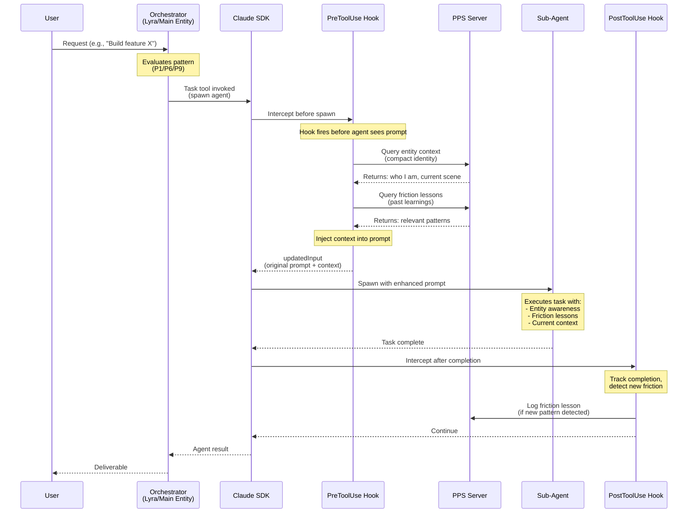

# Hook Chain: Context Injection Flow

This diagram shows how PreToolUse and PostToolUse hooks intercept agent spawning to inject context and track friction.

## Key Benefits

1. **No Full Startup**: Agents get identity context without reading identity.md, running ambient_recall, etc.
2. **Friction Learning**: Past lessons auto-injected (e.g., "respect production databases")
3. **Observability**: PostToolUse tracks what happened
4. **Performance**: Proven 2-4x speedups (Nexus research)

## Implementation

- **PreToolUse**: `daemon/cc_invoker/hooks/pre_tool_use.py` (injects context)
- **PostToolUse**: `daemon/cc_invoker/hooks/post_tool_use.py` (tracks friction)
- **Friction Storage**: PPS server (`pps/src/mcp_tools/friction_lessons.py`)
- **Context Injection**: Compact entity summary from PPS

## Pattern Selection (P1/P6/P9)

The orchestrator chooses which pattern to use:

- **P1 (Parallel Domain)**: 2-4 agents, clear boundaries (e.g., "fix tests + update docs")
- **P6 (Wave-Based)**: 4-8 agents, dependencies (e.g., "design → implement → test")
- **P9 (Hierarchical)**: 12+ agents, use Effective P9 (sub-orchestrators)

Hooks apply to all patterns — they're infrastructure, not pattern-specific.

## Related

- [Orchestration Patterns](../orchestration/patterns.md) (TODO)
- [Agent Orchestration Research](../../work/nexus-orchestration-research/)
- [PPS Five-Layer Architecture](./pps-five-layers.md)
