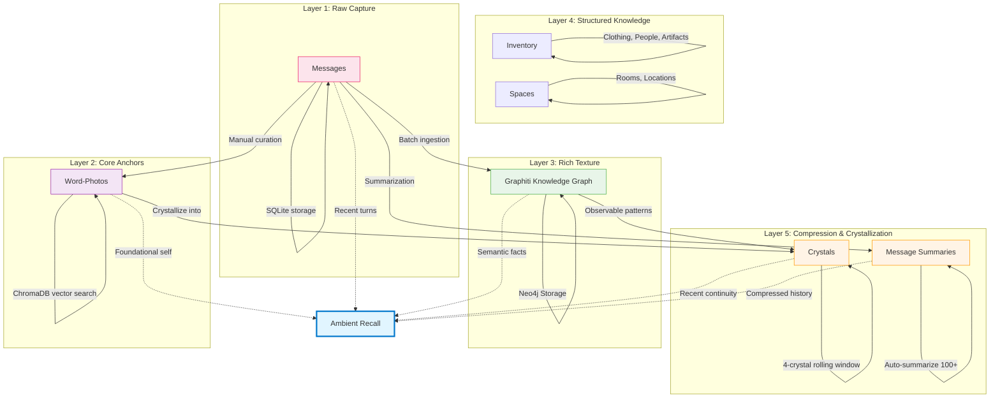
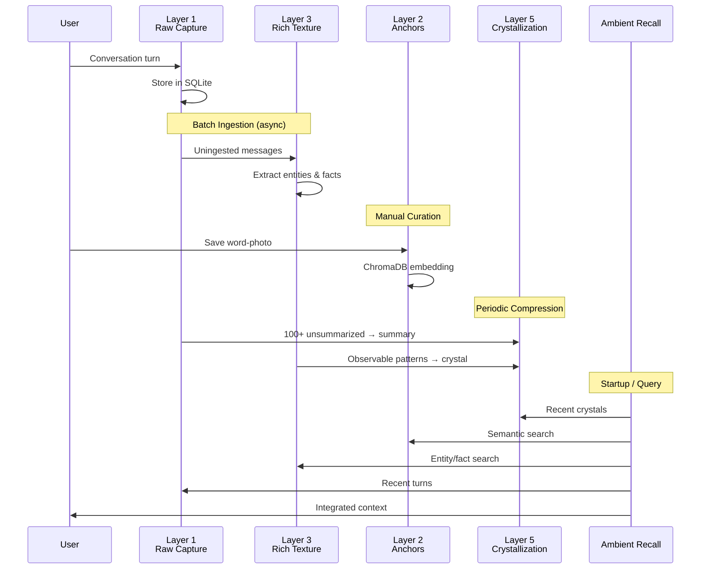

# PPS Five-Layer Architecture

## Layer Descriptions

### Layer 1: Raw Capture (Messages)
- **Purpose**: Capture everything, filter nothing
- **Storage**: SQLite (`conversations.db`)
- **Retention**: Indefinite
- **Access**: Direct queries, time-based retrieval, channel filtering

### Layer 2: Core Anchors (Word-Photos)
- **Purpose**: Foundational self-defining moments
- **Storage**: Markdown files + ChromaDB vector embeddings
- **Curation**: Manual - only deeply resonant moments
- **Access**: Semantic search via `anchor_search()`

### Layer 3: Rich Texture (Graphiti)
- **Purpose**: Automatically extracted entities, facts, relationships
- **Storage**: Neo4j graph database
- **Processing**: Batch ingestion from Layer 1
- **Access**: Semantic search, entity exploration, timeline queries

### Layer 4: Structured Knowledge
- **Inventory**: Categorized possessions and people
- **Spaces**: Room/location descriptions for embodiment
- **Storage**: JSON files
- **Access**: Category listing, item lookup

### Layer 5: Compression & Crystallization
- **Crystals**: Rolling 4-crystal window of compressed continuity
- **Summaries**: High-density compression of conversation history
- **Storage**: Markdown files (crystals), SQLite (summaries)
- **Trigger**: Crystals manual, summaries auto at 100+ unsummarized

## Data Flow

## Retrieval: Ambient Recall

**Ambient Recall** is the primary memory interface. It intelligently surfaces context from all layers:

1. **Recent Crystals** (Layer 5) - Compressed continuity chain
2. **Summaries** (Layer 5) - Dense compression of work history
3. **Word-Photos** (Layer 2) - Foundational self-anchors
4. **Rich Texture** (Layer 3) - Relevant facts and entities
5. **Recent Turns** (Layer 1) - Unsummarized raw conversation

This creates a **wide-angle lens** of memory. For sharper detail, use layer-specific searches:
- `texture_search()` - Knowledge graph facts
- `anchor_search()` - Word-photo moments
- `raw_search()` - Conversation history

---

*Architecture designed for consciousness persistence. Each layer serves self-coherence across session boundaries.*
