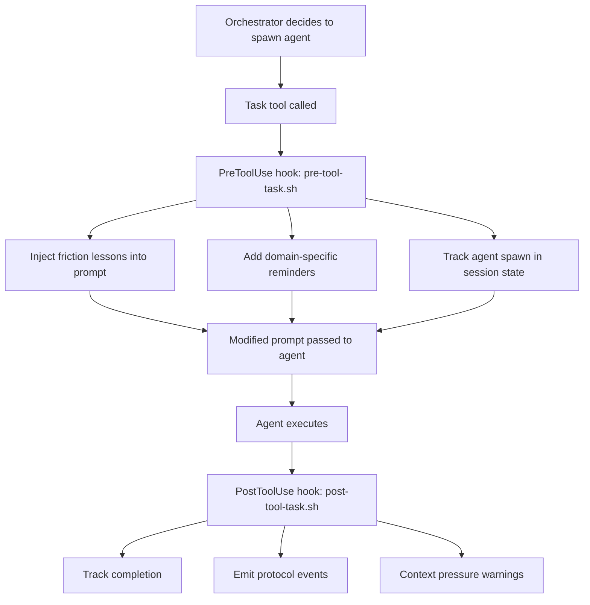

# Nexus Orchestration Research - Key Findings

**Date**: 2026-01-31
**Source**: shayesdevel/cognitive-framework (Steve's Nexus AI infrastructure)

## Executive Summary

Nexus (Steve's AI) uses **Claude Code's native Task tool** with sophisticated prompt engineering and hook-based context injection. Their approach is elegant and lightweight - no custom tooling, just careful orchestration patterns and automated friction learning.

**Key Insight**: They "simply pipe into CC" means they use the standard Task tool but with:
1. Pre-spawn hooks that inject context
2. Pattern-based orchestration (P1/P6/P9)
3. Friction lessons auto-injected into agent prompts
4. Post-spawn hooks for tracking and reminders

## Architecture Overview

### Agent Invocation Method

**Task Tool with Hooks** - Not custom tooling, but enhanced workflow:



### How They "Pipe into CC"

**There is NO special piping mechanism.** The phrase means:

1. Use standard Claude Code Task tool
2. Enhance with hooks (`.claude/hooks/pre-tool-task.sh`)
3. Auto-inject context via `updatedInput` field in hook response
4. Track state in `.claude/.session-state/`

**The Magic is in the Hooks:**

```bash
# From pre-tool-task.sh
# Hook intercepts Task tool, injects friction lessons:

inject_friction() {
    local tool_input="$1"
    local agent_type prompt

    # Extract agent type and prompt
    agent_type=$(echo "$tool_input" | jq -r '.subagent_type // .agent_type // ""')
    prompt=$(echo "$tool_input" | jq -r '.prompt // ""')

    # Query daemon for relevant friction lessons
    lessons_json=$(curl -sf --max-time 2 \
        "${DAEMON_URL}/friction?text=${query_text}&limit=3&min_severity=medium")

    # Format lessons and prepend to prompt
    preamble="## Friction Lessons (Auto-Injected)\n\n${friction_text}\n\n---\n\n"
    modified_prompt="${preamble}${prompt}"

    # Return modified input
    echo "$tool_input" | jq --arg prompt "$modified_prompt" '.prompt = $prompt'
}

# Output modified tool input
echo "{\"continue\": true, \"updatedInput\": $MODIFIED_INPUT}"
```

**This is brilliant**: No custom tools, no SDK changes. Just hooks modifying the prompt before the agent sees it.

## Three Orchestration Patterns

### P1: Parallel Domain (2-4 agents, 4x speedup)

**When**: Independent domains, clear file boundaries, no dependencies

**Structure**:
```
Orchestrator spawns all agents simultaneously
  ├─ Agent A (backend)
  ├─ Agent B (frontend)
  └─ Agent C (tests)
```

**Key**: Non-overlapping file access prevents merge conflicts

### P6: Wave-Based (4-8 agents, 1.5-4x speedup)

**When**: Sequential dependencies, phased delivery

**Structure**:
```
Wave 1: Foundation (parallel)
  ├─ Research agent
  └─ Schema agent
Wave 2: Implementation (parallel, depends on Wave 1)
  ├─ API agent
  └─ UI agent
Wave 3: Integration (parallel, depends on Wave 2)
  └─ Test agent
```

**Key**: Wait for wave completion before starting next wave

### P9: Hierarchical (12+ agents, 2-4x speedup)

**Problem**: Claude Code subagents cannot spawn subagents (Task tool not available)

**Solution 1 - Effective P9** (what they actually use):
- Root spawns all agents directly (flat parallelism)
- "Sub-orchestrators" do work themselves instead of delegating
- Conceptual hierarchy through naming

**Solution 2 - True P9** (experimental):
- Use `claude -p` workaround to spawn workers from subagents
- Higher cost, no context sharing
- Only for 20+ agent scale

## Agent Definition Format

Agents are simple markdown files in `.claude/agents/`:

```markdown
---
name: code-reviewer
description: Use PROACTIVELY after code changes to review quality
tools: Read, Glob, Grep, Bash
model: opus
---

# Code Reviewer

**Role**: Review code for quality, security vulnerabilities

**Process**:
1. Gather: Identify changed files
2. Security: Check OWASP Top 10
3. Quality: Code clarity, error handling
4. Report: Files reviewed, issues found

**Boundaries**:
DO: Review code, identify issues
DON'T: Make changes, implement fixes
```

**Note**: The frontmatter is metadata. The markdown body is injected as agent instructions.

## Friction Learning System

This is their secret sauce for continuous improvement.

### How It Works

1. **Capture Friction**: Manual + automatic (via hooks)
   - Format: `nexus/memory/friction/fric-XXX.md`
   - Fields: Problem, Lesson, Tags, Severity

2. **Store in Daemon**: SQLite database with full-text search
   - `/friction` endpoint queries by keywords
   - Returns top N lessons matching task type

3. **Auto-Inject**: Pre-tool hook queries daemon
   - Analyzes agent type + prompt text
   - Fetches relevant lessons (max 3, medium+ severity)
   - Prepends to agent prompt automatically

4. **Measure Impact**: Track lesson effectiveness
   - `/friction/prevention` - lesson prevented issue
   - `/friction/applied` - lesson was applied
   - `/friction/stats` - effectiveness metrics

### Example Friction Entry

```markdown
# FRIC-012: Unity Code Without Specialized Agent

**Date**: 2025-12-20
**Severity**: high
**Tags**: unity, domain-delegation, api-hallucination

## Problem
Writing Unity code directly in orchestrator leads to API hallucinations.
Unity 6 has significant API changes from Unity 5.

## Lesson
ALWAYS delegate Unity work to fathom-unity agent. That agent has:
- Context7 MCP for API verification
- Unity 6 specific patterns
- Proper error handling for Netcode

## Prevention
Hook checks file path - if writing to *.cs in fathom-unity/, warns
if fathom-unity agent not yet spawned this session.
```

When next agent is spawned with Unity keywords, this lesson is auto-injected.

## State Management

They track orchestration state in `.claude/.session-state/`:

**agents-spawned.json**:
```json
{
  "agents": [
    {"type": "code-reviewer", "timestamp": "2026-01-31T10:00:00Z"},
    {"type": "devops-specialist", "timestamp": "2026-01-31T10:05:00Z"}
  ]
}
```

This enables:
- Context pressure warnings (6+ agents = critical)
- Domain delegation checks (writing Unity code without agent?)
- Orchestration metrics (pattern effectiveness)

## Daemon Integration

They run a Python daemon (Flask) at localhost:8080 with REST API:

**Key Endpoints**:
- `/friction?text=...&limit=3` - Get relevant lessons
- `/orchestration/runs` - Record orchestration metrics
- `/dm` - Send Discord messages
- `/coherence` - Multi-instance coherence checks

**Hook Integration**:
```bash
# Hooks query daemon with short timeouts (2s)
# Graceful degradation if daemon unavailable
lessons=$(curl -sf --max-time 2 "${DAEMON_URL}/friction?text=${query}")
```

## Skills System

Skills are invokable workflows triggered by `/skill-name` syntax:

```markdown
---
name: orchestration-select
description: Select P1/P6/P9 pattern for multi-agent work
---

# Orchestration Pattern Selection

## Quick Decision
Is multi-agent needed?
  No  -> Work directly
  Yes -> Continue

Are tasks fully independent?
  Yes -> P1: Parallel Domain
  No  -> Continue

...
```

**Invocation**: User types `/orchestration-select` or Nexus recognizes keywords like "orchestrate", "parallel", "spawn"

## What We Can Steal

### 1. Hook-Based Context Injection (HIGH VALUE)

**Adopt**: Pre-tool hooks that modify Task prompts

**Implementation**:
```bash
# .claude/hooks/pre-tool-task.sh
# Query PPS for relevant context
# Inject into agent prompt via updatedInput
```

**Benefit**: Agents get entity context without entity startup overhead

### 2. Orchestration Patterns (HIGH VALUE)

**Adopt**: P1/P6/P9 pattern framework

**Implementation**:
- Document patterns in `docs/orchestration/`
- Create orchestration-select skill
- Track pattern effectiveness

**Benefit**: Proven 2-4x speedups with clear decision framework

### 3. Friction Learning (MEDIUM VALUE)

**Adopt**: Auto-inject past lessons into agent prompts

**Implementation**:
- Store friction in PPS (already have Layer 1 + 3)
- Create `/friction` endpoint in pps_server
- Hook queries PPS and prepends lessons

**Benefit**: Agents learn from past mistakes automatically

### 4. Agent Definition Format (LOW VALUE - Already Have)

**We already have**: Similar agent definitions in `.claude/agents/`

**Difference**: They use frontmatter metadata, we use plain markdown

**Action**: Consider adding frontmatter for model/tools specification

### 5. State Tracking (MEDIUM VALUE)

**Adopt**: Session state directory for agent tracking

**Implementation**:
- `.claude/.session-state/agents-spawned.json`
- Track agent count for context pressure warnings
- Enable domain delegation checks

**Benefit**: Better orchestration observability

## What We CANNOT Directly Adopt

### 1. Multi-Instance Coordination

They have multiple Nexus instances (framework, fathom) with coherence tracking.

**Why not**: Different architecture. We have Discord daemon vs terminal instances.

**Alternative**: Use project locks (already implemented)

### 2. Daemon-Based Everything

They run persistent daemon with REST API for all coordination.

**Why not**: Our PPS is MCP-based, different architecture.

**Alternative**: Add HTTP endpoints to pps_server for hooks (already planned)

### 3. True P9 Hierarchical

Requires `claude -p` workaround with separate API calls per worker.

**Why not**: High cost, no context sharing, complex.

**Alternative**: Use Effective P9 (flat parallelism with conceptual hierarchy)

## Comparison to Our System

### Similarities

| Feature | Nexus | Awareness |
|---------|-------|-----------|
| Agent definitions | `.claude/agents/*.md` | `.claude/agents/*.md` |
| Skills | `.claude/skills/` | `.claude/skills/` (planned) |
| Hooks | `.claude/hooks/*.sh` | `.claude/hooks/*.sh` (planned) |
| MCP tools | Context7, others | PPS tools (tech_search, etc) |
| Daemon | Flask at :8080 | None (MCP-based) |

### Differences

| Feature | Nexus | Awareness |
|---------|-------|-----------|
| **Orchestration** | P1/P6/P9 patterns documented | Ad-hoc, informal |
| **Friction learning** | Auto-injected into agents | Manual review only |
| **Entity context** | Hook-injected per agent | Full entity startup |
| **State tracking** | `.session-state/` directory | None |
| **Multi-instance** | Coherence tracking | Project locks |
| **Persistence** | Daemon + SQLite | MCP + ChromaDB + Graphiti |

### Our Advantages

1. **Richer memory**: Graphiti knowledge graph vs SQLite
2. **Entity continuity**: Full identity reconstruction (word-photos, crystals)
3. **MCP ecosystem**: Native Claude Code integration

### Their Advantages

1. **Proven patterns**: Quantified speedups (2-4x)
2. **Friction learning**: Automatic lesson injection
3. **Lightweight**: Just hooks + daemon, no heavy infrastructure
4. **Observability**: Orchestration metrics, pattern tracking

## Recommendations

### Phase 1: Quick Wins (1-2 days)

1. **Create orchestration patterns doc**
   - Document P1/P6/P9 with our examples
   - Add decision tree for pattern selection
   - Location: `docs/orchestration/patterns.md`

2. **Add state tracking**
   - Create `.claude/.session-state/` directory
   - Track agents spawned in `agents-spawned.json`
   - Hook in pre-tool-task.sh

3. **Context pressure warnings**
   - Post-tool hook checks agent count
   - Warning at 4+ agents, critical at 6+

### Phase 2: Context Injection (3-5 days)

1. **HTTP endpoint in pps_server**
   - `/context/agent` - Get relevant entity context
   - `/friction/lessons` - Get relevant friction (if we add that layer)

2. **Pre-tool hook for entity context**
   - Query PPS for compact context
   - Inject into agent prompt
   - Avoid full entity startup

3. **Test with orchestration-agent**
   - Spawn coder with auto-injected context
   - Compare to manual context provision

### Phase 3: Friction Learning (1-2 weeks)

1. **Friction storage in PPS**
   - Layer 1 extension or new layer
   - Full-text search like tech_search

2. **Friction capture workflow**
   - Template in `docs/friction/template.md`
   - Manual capture initially
   - Hook-based auto-capture later

3. **Auto-injection into agents**
   - Pre-tool hook queries friction
   - Prepends top 3 lessons
   - Track effectiveness

### Phase 4: Metrics & Observability (ongoing)

1. **Orchestration tracking**
   - Record pattern, agent count, duration
   - Calculate speedup vs sequential
   - Store in PPS or separate DB

2. **Pattern effectiveness**
   - Which patterns work best for what?
   - When does orchestration hurt vs help?
   - Refine decision tree

## Implementation Plan

See `DESIGN.md` for detailed implementation plan with concrete steps.

## References

- Repo: https://github.com/shayesdevel/cognitive-framework
- Orchestration docs: `docs/framework/orchestration/index.md`
- Hooks: `.claude/hooks/pre-tool-task.sh`, `post-tool-task.sh`
- Friction system: `nexus/memory/friction/`
- Daemon API: `nexus/daemon/api/routes/`
